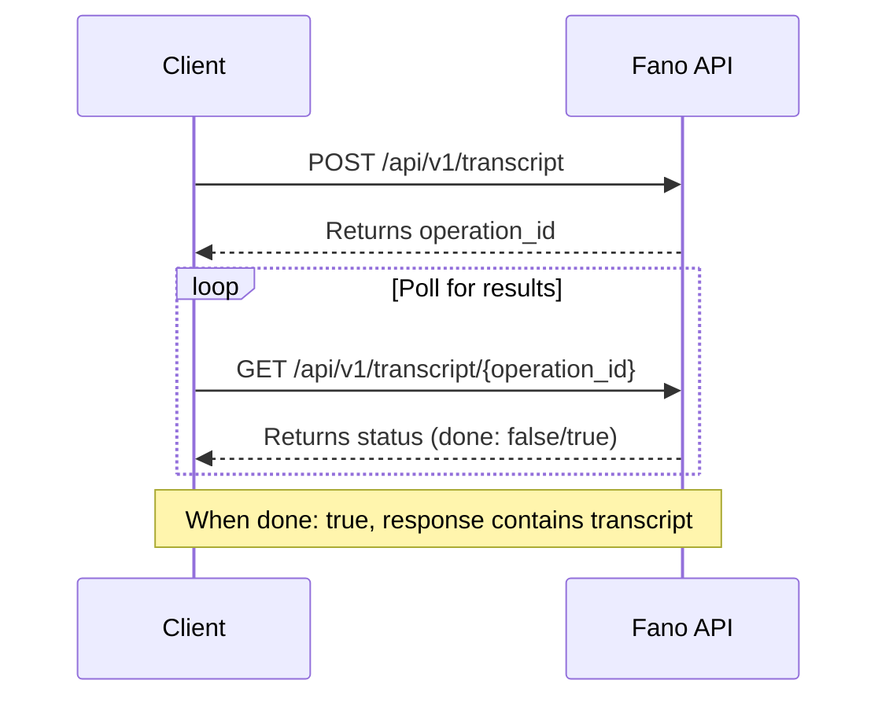

<Note>
This is the first step of the transcription workflow. After submitting, use the returned `operation_id` to poll for results.
</Note>

## Workflow

## Audio Input Options

You can provide audio in two ways:

| Method | Field | Description |
|--------|-------|-------------|
| **URI** | `audio.uri` | Public URL to your audio file |
| **Base64** | `audio.content` | Base64-encoded audio content |

<Tip>
For large files, we recommend using a URI to avoid request size limits.
</Tip>

## Supported Configurations

### Language Codes

| Code | Language |
|------|----------|
| `yue` | Cantonese |
| `cmn` | Mandarin |
| `en` | English |
| `yue-x-auto` | Multilingual (auto-detect) |

### Audio Encodings

| Encoding | Format |
|----------|--------|
| `LINEAR16` | 16-bit PCM WAV (recommended) |
| `MULAW` | 8-bit μ-law WAV |
| `MP3` | MPEG Audio Layer III |
| `FLAC` | Free Lossless Audio Codec |
| `OGG_OPUS` | Ogg Opus |
| `AAC` | Advanced Audio Coding |
