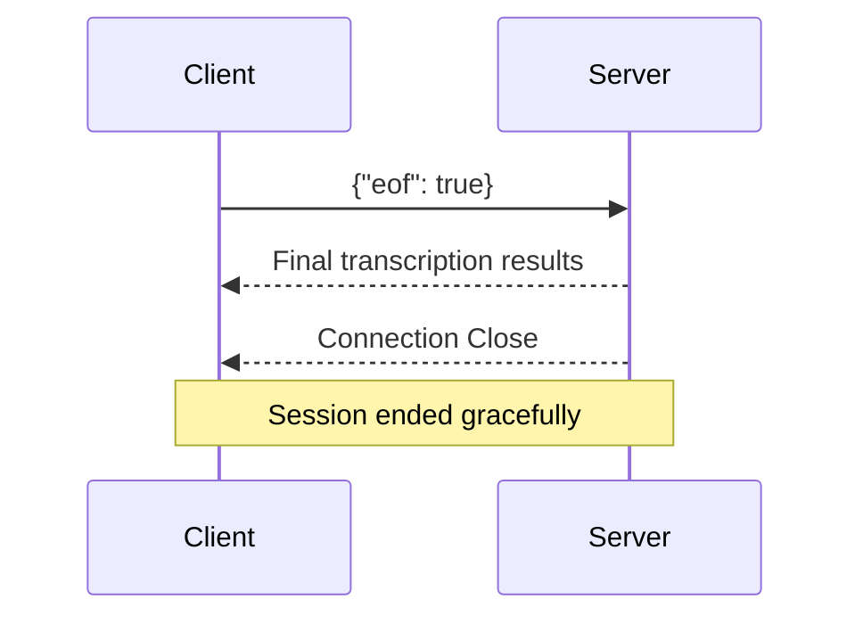

## Overview

Send the EOF (End of File) message to gracefully terminate the streaming session. The server will:

1. Finish processing any remaining audio in the buffer
2. Send final transcription results
3. Close the WebSocket connection

## Message Format

```json
{
  "eof": true
}
```

<Warning>
Always send EOF before closing the connection to ensure all audio is processed and final results are received.
</Warning>

## When to Send EOF

| Scenario | Action |
|----------|--------|
| User stops speaking | Send EOF |
| Audio file ends | Send EOF |
| Session timeout | Send EOF |
| User cancels | Send EOF, then close connection |

## Code Examples

<Tabs>
  <Tab title="Python">
```python
async def end_session(ws):
    # Send EOF message
    await ws.send(json.dumps({"eof": True}))
    
    # Wait for final results before closing
    try:
        async for message in ws:
            response = json.loads(message)
            if response.get("results"):
                # Process any remaining results
                for result in response["results"]:
                    if result.get("isFinal"):
                        print(f"Final: {result['alternatives'][0]['transcript']}")
    except websockets.exceptions.ConnectionClosed:
        print("Connection closed by server")
```
  </Tab>
  <Tab title="JavaScript">
```javascript
function endSession() {
  // Send EOF message
  ws.send(JSON.stringify({ eof: true }));
  
  // The server will close the connection after sending final results
  ws.on('close', () => {
    console.log('Session ended gracefully');
  });
}

// Example: End session when user clicks stop button
document.getElementById('stopButton').onclick = endSession;
```
  </Tab>
</Tabs>

## Connection Closure Flow



## Error Handling

If you close the connection without sending EOF:

- Any buffered audio may not be processed
- You may miss final transcription results
- The session will be terminated abruptly

<Tip>
Always implement a cleanup function that sends EOF before closing, even in error scenarios.
</Tip>

```python
async def safe_close(ws):
    try:
        await ws.send(json.dumps({"eof": True}))
        await asyncio.sleep(1)  # Allow time for final results
    except Exception as e:
        print(f"Error during cleanup: {e}")
    finally:
        await ws.close()
```
