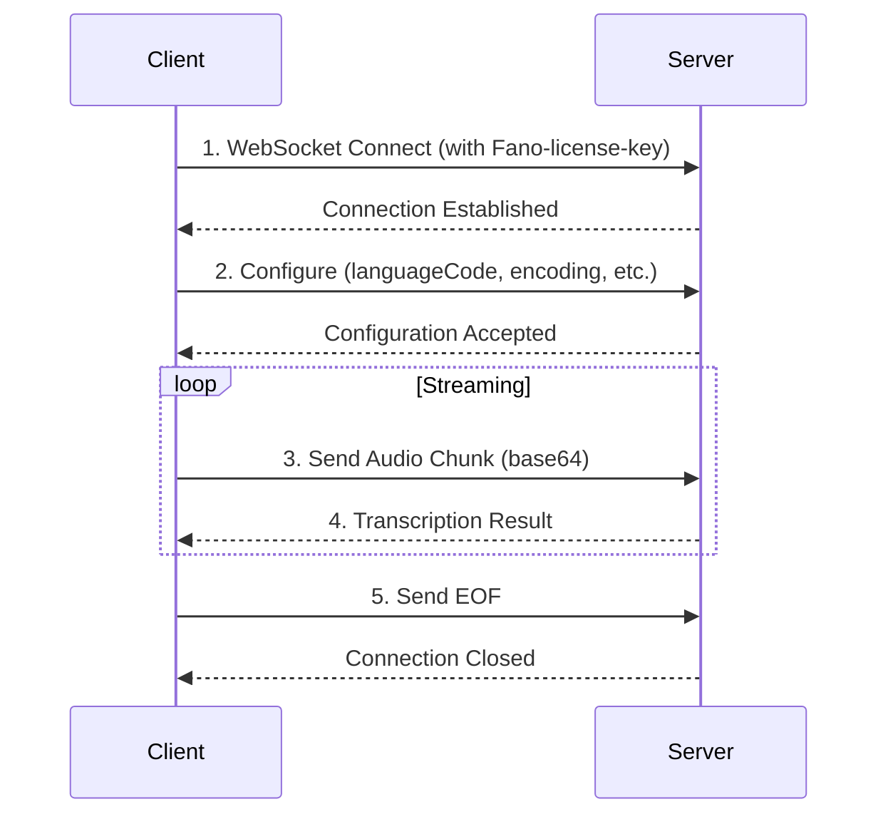

<Note>
This is a **WebSocket API**. Unlike REST APIs, you establish a persistent connection and exchange messages bidirectionally.
</Note>

## Overview

The Streaming Transcription API enables real-time speech-to-text transcription over a WebSocket connection. It's optimized for low-latency applications where immediate transcription feedback is essential.

<CardGroup cols={2}>
  <Card title="Live Agent Assist" icon="headset">
    Transcribe contact center calls in real-time to trigger compliance alerts
  </Card>
  <Card title="Meeting Transcription" icon="users">
    Live notetaking for Cantonese, Mandarin, and English meetings
  </Card>
  <Card title="Voice Assistants" icon="microphone">
    Real-time voice command processing
  </Card>
  <Card title="Captioning" icon="closed-captioning">
    Live subtitles for broadcasts and streams
  </Card>
</CardGroup>

---

## Quick Start

<Steps>
  <Step title="Get your API Key">
    Obtain your `Fano-license-key` from the Developer Portal
  </Step>
  <Step title="Connect to WebSocket">
    Establish a secure WebSocket connection to the endpoint
  </Step>
  <Step title="Send Configuration">
    Initialize the session with your language and audio settings
  </Step>
  <Step title="Stream Audio">
    Send audio chunks and receive real-time transcriptions
  </Step>
</Steps>

---

## Base URL

```bash
wss://app.fano.ai/api/v1/speech-to-text/streaming-transcript
```

---

## Authentication

<ParamField header="Fano-license-key" type="string" required>
  Your unique license key provided by Fano Labs
</ParamField>

---

## Connection Workflow



---

## Message Reference

### Step 1: Configure Stream

<Expandable title="Request Schema">

| Field | Type | Required | Description |
|-------|------|----------|-------------|
| `config.languageCode` | string | ✅ | Language code: `yue`, `cmn`, `en`, `yue-x-auto` |
| `config.sampleRateHertz` | integer | ✅ | Sample rate: 8000-48000 (optimal: 16000) |
| `config.encoding` | string | ✅ | Audio encoding: `LINEAR16` or `MULAW` |
| `config.enableAutomaticPunctuation` | boolean | ❌ | Add punctuation (default: `false`) |
| `config.interimResults` | boolean | ❌ | Return interim results (default: `false`) |
| `config.speechContexts.keywords` | string[] | ❌ | Keywords for biasing (max 1000) |

</Expandable>

<CodeGroup>

```json Basic
{
  "config": {
    "languageCode": "yue",
    "sampleRateHertz": 16000,
    "encoding": "LINEAR16"
  }
}
```

```json With All Options
{
  "config": {
    "languageCode": "yue-x-auto",
    "sampleRateHertz": 16000,
    "encoding": "LINEAR16",
    "enableAutomaticPunctuation": true,
    "interimResults": true,
    "speechContexts": {
      "keywords": ["Fano", "transcription"]
    }
  }
}
```

</CodeGroup>

---

### Step 2: Send Audio Chunks

<Expandable title="Request Schema">

| Field | Type | Required | Description |
|-------|------|----------|-------------|
| `audioContent` | string | ✅ | Base64-encoded audio data |

</Expandable>

<Tip>
**Recommended chunk size:** 100ms - 500ms of audio data for optimal latency and accuracy.
</Tip>

```json
{
  "audioContent": "UklGRiQAAABXQVZFZm10IBAAAAABAAEAgD4AAAB9..."
}
```

---

### Step 3: Receive Results

<Expandable title="Response Schema">

| Field | Type | Description |
|-------|------|-------------|
| `results[].alternatives[].transcript` | string | Transcribed text |
| `results[].alternatives[].confidence` | float | Confidence score (0.0-1.0) |
| `results[].alternatives[].startTime` | string | Start time (e.g., "0.000s") |
| `results[].alternatives[].endTime` | string | End time (e.g., "3.200s") |
| `results[].alternatives[].languageCode` | string | Detected language |
| `results[].resultEndTime` | string | Result end time |
| `results[].channelTag` | integer | Channel identifier |
| `results[].isFinal` | boolean | `true` = final, `false` = interim |
| `metadata.asrModels` | string[] | Models used |

</Expandable>

<CodeGroup>

```json Interim Result
{
  "results": [
    {
      "alternatives": [
        {
          "transcript": "Hello, how can I",
          "confidence": 0.0,
          "startTime": "0.000s",
          "endTime": "1.500s",
          "languageCode": "en"
        }
      ],
      "resultEndTime": "1.500s",
      "channelTag": 1,
      "isFinal": false
    }
  ],
  "metadata": {
    "asrModels": ["model_1"]
  }
}
```

```json Final Result
{
  "results": [
    {
      "alternatives": [
        {
          "transcript": "Hello, how can I help you today?",
          "confidence": 0.95,
          "startTime": "0.000s",
          "endTime": "3.200s",
          "languageCode": "en"
        }
      ],
      "resultEndTime": "3.200s",
      "channelTag": 1,
      "isFinal": true
    }
  ],
  "metadata": {
    "asrModels": ["model_1", "model_2"]
  }
}
```

</CodeGroup>

---

### Step 4: Send EOF

```json
{
  "eof": true
}
```

---

## Code Examples

<Tabs>
  <Tab title="Python">
```python
import asyncio
import websockets
import json
import base64

API_KEY = 'YOUR_FANO_API_KEY'
URL = "wss://app.fano.ai/api/v1/speech-to-text/streaming-transcript"

async def stream_audio():
    headers = {"Fano-license-key": API_KEY}
    
    config_msg = {
        "config": {
            "languageCode": "yue-x-auto",
            "sampleRateHertz": 16000,
            "encoding": "LINEAR16",
            "enableAutomaticPunctuation": True,
            "interimResults": True
        }
    }

    async with websockets.connect(URL, extra_headers=headers) as ws:
        # Send configuration
        await ws.send(json.dumps(config_msg))
        print("Connected to Fano Streaming API...")

        # Example: Send audio file in chunks
        with open("audio.raw", "rb") as f:
            while chunk := f.read(3200):
                audio_msg = {
                    "audioContent": base64.b64encode(chunk).decode()
                }
                await ws.send(json.dumps(audio_msg))
                
                # Receive results
                try:
                    response = await asyncio.wait_for(ws.recv(), timeout=0.1)
                    result = json.loads(response)
                    if result.get("results"):
                        transcript = result["results"][0]["alternatives"][0]["transcript"]
                        is_final = result["results"][0].get("isFinal", False)
                        prefix = "Final" if is_final else "Interim"
                        print(f"{prefix}: {transcript}")
                except asyncio.TimeoutError:
                    pass

        # Send EOF
        await ws.send(json.dumps({"eof": True}))

asyncio.run(stream_audio())
```
  </Tab>
  <Tab title="JavaScript">
```javascript
const WebSocket = require('ws');

const API_KEY = 'YOUR_FANO_API_KEY';
const URL = 'wss://app.fano.ai/api/v1/speech-to-text/streaming-transcript';

const ws = new WebSocket(URL, {
  headers: { 'Fano-license-key': API_KEY }
});

ws.on('open', () => {
  console.log('Connected to Fano Streaming API...');

  // Send configuration
  ws.send(JSON.stringify({
    config: {
      languageCode: 'yue-x-auto',
      sampleRateHertz: 16000,
      encoding: 'LINEAR16',
      enableAutomaticPunctuation: true,
      interimResults: true
    }
  }));

  // Example: Send audio chunks
  // In real usage, stream from microphone or file
  const audioChunk = Buffer.from('...').toString('base64');
  ws.send(JSON.stringify({ audioContent: audioChunk }));
});

ws.on('message', (data) => {
  const response = JSON.parse(data);
  
  if (response.results?.[0]) {
    const { transcript } = response.results[0].alternatives[0];
    const isFinal = response.results[0].isFinal;
    console.log(`${isFinal ? 'Final' : 'Interim'}: ${transcript}`);
  }
  
  if (response.error) {
    console.error('Error:', response.error.message);
  }
});

ws.on('close', () => console.log('Connection closed'));
ws.on('error', (err) => console.error('Error:', err));
```
  </Tab>
  <Tab title="wscat (Test)">
```bash
# WebSocket connections cannot be tested with cURL directly.
# Use wscat for testing:

npm install -g wscat

wscat -c "wss://app.fano.ai/api/v1/speech-to-text/streaming-transcript" \
  -H "Fano-license-key: YOUR_API_KEY"

# Then send messages:
> {"config":{"languageCode":"en","sampleRateHertz":16000,"encoding":"LINEAR16"}}
> {"audioContent":"BASE64_AUDIO_DATA"}
> {"eof":true}
```
  </Tab>
</Tabs>

---

## Error Handling

<ResponseField name="error" type="object">
  <Expandable title="properties">
    <ResponseField name="code" type="integer">
      gRPC status code
    </ResponseField>
    <ResponseField name="message" type="string">
      Human-readable error description
    </ResponseField>
  </Expandable>
</ResponseField>

| Code | Description | Troubleshooting |
|------|-------------|-----------------|
| `401` | Unauthorized | Verify your `Fano-license-key` is correct |
| `400` | Bad Request | Check JSON format or Base64 encoding |
| `3` | Invalid Argument | Verify message schema matches specification |

```json Error Response
{
  "error": {
    "code": 3,
    "message": "invalid message format"
  }
}
```

---

## Audio Requirements

<Warning>
Audio must conform to these requirements or transcription will fail.
</Warning>

| Requirement | Specification |
|-------------|---------------|
| **Encoding** | `LINEAR16` (PCM 16-bit) or `MULAW` |
| **Channels** | Single channel (mono) only |
| **Sample Rate** | 8000 Hz - 48000 Hz |
| **Recommended Rate** | 16000 Hz |

---

## Supported Languages

| Code | Language | Notes |
|------|----------|-------|
| `yue` | Cantonese | |
| `cmn` | Mandarin Chinese | |
| `en` | English | |
| `yue-x-auto` | Multilingual | Automatic language detection for code-switching |
