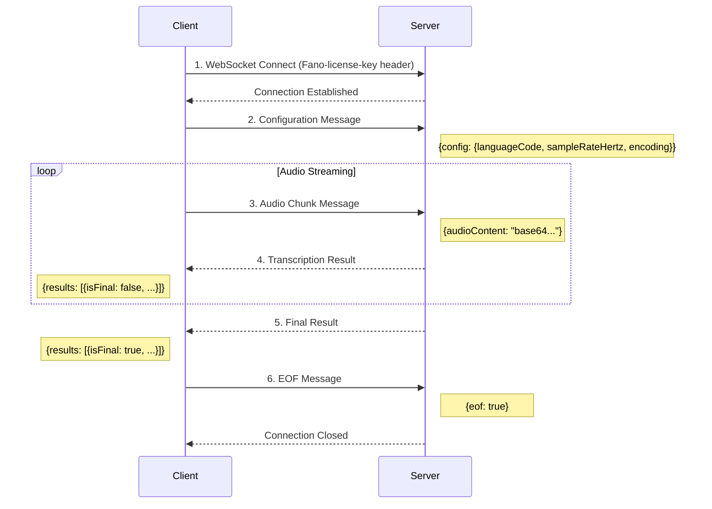

<Warning>
**Authentication Required**: Include `Fano-license-key` header when connecting. The WebSocket playground above may not support custom headers - use the code examples below for testing.
</Warning>

## Overview

The Streaming Transcription API provides **real-time speech-to-text** transcription over a persistent WebSocket connection. Optimized for low-latency applications requiring immediate feedback.

<CardGroup cols={2}>
  <Card title="Live Agent Assist" icon="headset">
    Real-time transcription for contact center compliance monitoring
  </Card>
  <Card title="Meeting Transcription" icon="users">
    Live notetaking for Cantonese, Mandarin, and English meetings
  </Card>
  <Card title="Voice Assistants" icon="microphone">
    Real-time voice command processing with sub-second latency
  </Card>
  <Card title="Live Captioning" icon="closed-captioning">
    Instant subtitles for broadcasts, streams, and events
  </Card>
</CardGroup>

---

## Quick Start

<Steps>
  <Step title="Connect with Authentication">
    Establish WebSocket connection to `wss://app.fano.ai/api/v1/speech-to-text/streaming-transcript` with `Fano-license-key` header
  </Step>
  <Step title="Send Configuration">
    Send a JSON message with language, sample rate, and encoding settings
  </Step>
  <Step title="Stream Audio">
    Send Base64-encoded audio chunks continuously
  </Step>
  <Step title="Receive Results">
    Process incoming transcription results (interim and final)
  </Step>
  <Step title="Close Session">
    Send EOF message to gracefully close the connection
  </Step>
</Steps>

---

## Authentication

<Info>
The `Fano-license-key` must be included as a **WebSocket handshake header**. Contact [support@fano.ai](mailto:support@fano.ai) to obtain your API key.
</Info>

| Header | Required | Description |
|--------|----------|-------------|
| `Fano-license-key` | ✅ Yes | Your API license key |

```bash Example Connection with wscat
wscat -c "wss://app.fano.ai/api/v1/speech-to-text/streaming-transcript" \
  -H "Fano-license-key: YOUR_API_KEY"
```

---

## Message Flow



---

## Client → Server Messages

### 1. Configuration Message

<Tip>
Send this message **immediately after connecting** to initialize the transcription session.
</Tip>

<ParamField body="config.languageCode" type="string" required>
  Language for transcription:
  | Code | Language | Description |
  |------|----------|-------------|
  | `yue` | Cantonese | Hong Kong, Guangdong |
  | `cmn` | Mandarin | Mainland China, Taiwan |
  | `en` | English | International |
  | `yue-x-auto` | Multilingual | Auto-detect mixed languages |
</ParamField>

<ParamField body="config.sampleRateHertz" type="integer" required>
  Audio sample rate in Hz. Range: `8000` - `48000`. **Recommended: `16000`**
</ParamField>

<ParamField body="config.encoding" type="string" required>
  Audio encoding format:
  | Value | Description |
  |-------|-------------|
  | `LINEAR16` | PCM 16-bit signed little-endian (recommended) |
  | `MULAW` | 8-bit μ-law |
</ParamField>

<ParamField body="config.enableAutomaticPunctuation" type="boolean" default="false">
  Add punctuation marks (。，！？) to transcription results
</ParamField>

<ParamField body="config.interimResults" type="boolean" default="false">
  Return interim (tentative) results before final results. Useful for real-time display.
</ParamField>

<ParamField body="config.speechContexts.keywords" type="string[]">
  Keywords to boost recognition accuracy. Max 1000 items.
  ```json
  "speechContexts": {
    "keywords": ["Fano Labs", "語音識別", "ASR"]
  }
  ```
</ParamField>

<CodeGroup>
```json Minimal Configuration
{
  "config": {
    "languageCode": "yue",
    "sampleRateHertz": 16000,
    "encoding": "LINEAR16"
  }
}
```

```json Full Configuration
{
  "config": {
    "languageCode": "yue-x-auto",
    "sampleRateHertz": 16000,
    "encoding": "LINEAR16",
    "enableAutomaticPunctuation": true,
    "interimResults": true,
    "speechContexts": {
      "keywords": ["Fano Labs", "語音識別"]
    }
  }
}
```
</CodeGroup>

---

### 2. Audio Chunk Message

<ParamField body="audioContent" type="string" required>
  Base64-encoded audio data.
</ParamField>

<Tip>
**Recommended chunk size:** 100-500ms of audio
- **100ms** = 3,200 bytes at 16kHz/16-bit mono (lowest latency)
- **250ms** = 8,000 bytes (balanced)
- **500ms** = 16,000 bytes (best accuracy)
</Tip>

```json
{
  "audioContent": "UklGRiQAAABXQVZFZm10IBAAAAABAAEAgD4AAAB9AAACABAAZGF0YQAAAAA="
}
```

---

### 3. EOF Message

Send to gracefully close the session when audio streaming is complete.

```json
{
  "eof": true
}
```

---

## Server → Client Messages

### Transcription Result

<ResponseField name="results" type="array">
  Array of transcription results
</ResponseField>

<ResponseField name="results[].alternatives" type="array">
  Transcription alternatives (usually 1)
</ResponseField>

<ResponseField name="results[].alternatives[].transcript" type="string">
  The transcribed text
</ResponseField>

<ResponseField name="results[].alternatives[].confidence" type="number">
  Confidence score (0.0 - 1.0). Note: `0.0` for interim results where confidence is not calculated.
</ResponseField>

<ResponseField name="results[].isFinal" type="boolean">
  - `false` — Interim result (may change as more audio is processed)
  - `true` — Final result (will not change)
</ResponseField>

<CodeGroup>
```json Interim Result (isFinal: false)
{
  "results": [{
    "alternatives": [{
      "transcript": "你好",
      "confidence": 0.0,
      "startTime": "0.000s",
      "endTime": "0.800s",
      "languageCode": "yue"
    }],
    "isFinal": false,
    "channelTag": 1,
    "resultEndTime": "0.800s"
  }],
  "metadata": {
    "asrModels": ["cantonese-v2"]
  }
}
```

```json Final Result (isFinal: true)
{
  "results": [{
    "alternatives": [{
      "transcript": "你好，有咩可以幫到你？",
      "confidence": 0.95,
      "startTime": "0.000s",
      "endTime": "2.500s",
      "languageCode": "yue"
    }],
    "isFinal": true,
    "channelTag": 1,
    "resultEndTime": "2.500s"
  }],
  "metadata": {
    "asrModels": ["cantonese-v2"]
  }
}
```
</CodeGroup>

---

### Error Message

```json
{
  "error": {
    "code": 3,
    "message": "invalid languageCode: must be one of yue, cmn, en, yue-x-auto"
  }
}
```

| Code | Description | Solution |
|------|-------------|----------|
| `3` | Invalid Argument | Check message format and parameter values |
| `400` | Bad Request | Verify JSON syntax and Base64 encoding |
| `401` | Unauthorized | Verify `Fano-license-key` header |

---

## Code Examples

<Tabs>
  <Tab title="Python">
```python
import asyncio
import websockets
import json
import base64

API_KEY = "YOUR_FANO_LICENSE_KEY"
WS_URL = "wss://app.fano.ai/api/v1/speech-to-text/streaming-transcript"

async def transcribe_audio(audio_file: str):
    """Stream audio file and print transcription results."""
    headers = {"Fano-license-key": API_KEY}
    
    async with websockets.connect(WS_URL, extra_headers=headers) as ws:
        # Step 1: Send configuration
        config = {
            "config": {
                "languageCode": "yue-x-auto",
                "sampleRateHertz": 16000,
                "encoding": "LINEAR16",
                "enableAutomaticPunctuation": True,
                "interimResults": True
            }
        }
        await ws.send(json.dumps(config))
        print("✓ Connected and configured")

        # Step 2: Stream audio chunks
        chunk_size = 3200  # 100ms at 16kHz, 16-bit mono
        with open(audio_file, "rb") as f:
            while chunk := f.read(chunk_size):
                await ws.send(json.dumps({
                    "audioContent": base64.b64encode(chunk).decode()
                }))
                
                # Check for results (non-blocking)
                try:
                    response = await asyncio.wait_for(ws.recv(), timeout=0.05)
                    result = json.loads(response)
                    
                    if "results" in result:
                        alt = result["results"][0]["alternatives"][0]
                        is_final = result["results"][0].get("isFinal", False)
                        marker = "✓ FINAL:" if is_final else "... interim:"
                        print(f"{marker} {alt['transcript']}")
                    
                    if "error" in result:
                        print(f"✗ Error: {result['error']['message']}")
                        
                except asyncio.TimeoutError:
                    pass

        # Step 3: Send EOF and collect remaining results
        await ws.send(json.dumps({"eof": True}))
        print("✓ EOF sent")
        
        async for message in ws:
            result = json.loads(message)
            if "results" in result and result["results"][0].get("isFinal"):
                transcript = result["results"][0]["alternatives"][0]["transcript"]
                print(f"✓ FINAL: {transcript}")

# Run
asyncio.run(transcribe_audio("audio.raw"))
```
  </Tab>
  
  <Tab title="JavaScript (Node.js)">
```javascript
const WebSocket = require('ws');
const fs = require('fs');

const API_KEY = 'YOUR_FANO_LICENSE_KEY';
const WS_URL = 'wss://app.fano.ai/api/v1/speech-to-text/streaming-transcript';

function transcribeAudio(audioFile) {
  const ws = new WebSocket(WS_URL, {
    headers: { 'Fano-license-key': API_KEY }
  });

  ws.on('open', () => {
    console.log('✓ Connected');
    
    // Step 1: Send configuration
    ws.send(JSON.stringify({
      config: {
        languageCode: 'yue-x-auto',
        sampleRateHertz: 16000,
        encoding: 'LINEAR16',
        enableAutomaticPunctuation: true,
        interimResults: true
      }
    }));

    // Step 2: Stream audio chunks
    const audio = fs.readFileSync(audioFile);
    const chunkSize = 3200; // 100ms at 16kHz
    
    for (let i = 0; i < audio.length; i += chunkSize) {
      const chunk = audio.slice(i, i + chunkSize);
      ws.send(JSON.stringify({
        audioContent: chunk.toString('base64')
      }));
    }

    // Step 3: Send EOF
    ws.send(JSON.stringify({ eof: true }));
    console.log('✓ EOF sent');
  });

  ws.on('message', (data) => {
    const result = JSON.parse(data);
    
    if (result.results?.[0]) {
      const { transcript } = result.results[0].alternatives[0];
      const isFinal = result.results[0].isFinal;
      const marker = isFinal ? '✓ FINAL:' : '... interim:';
      console.log(`${marker} ${transcript}`);
    }
    
    if (result.error) {
      console.error(`✗ Error: ${result.error.message}`);
    }
  });

  ws.on('close', () => console.log('✓ Connection closed'));
  ws.on('error', (err) => console.error('✗ Error:', err.message));
}

transcribeAudio('audio.raw');
```
  </Tab>
  
  <Tab title="cURL + wscat">
```bash
# Install wscat
npm install -g wscat

# Connect with authentication
wscat -c "wss://app.fano.ai/api/v1/speech-to-text/streaming-transcript" \
  -H "Fano-license-key: YOUR_API_KEY"

# After connection, send messages manually:

# 1. Configuration (paste this JSON)
{"config":{"languageCode":"yue-x-auto","sampleRateHertz":16000,"encoding":"LINEAR16","interimResults":true}}

# 2. Audio chunk (Base64 encoded)
{"audioContent":"UklGRiQAAABXQVZFZm10IBAAAAABAAEAgD4AAAB9AAACABAAZGF0YQAAAAA="}

# 3. End session
{"eof":true}
```
  </Tab>

  <Tab title="Browser (with Proxy)">
```javascript
// Note: Browser WebSocket API doesn't support custom headers.
// You need a proxy server to add the Fano-license-key header.

// Example using a proxy endpoint
const WS_URL = 'wss://your-proxy.com/fano-streaming?apiKey=YOUR_API_KEY';

async function startMicrophoneStream() {
  // Get microphone
  const stream = await navigator.mediaDevices.getUserMedia({
    audio: { sampleRate: 16000, channelCount: 1 }
  });
  
  const audioContext = new AudioContext({ sampleRate: 16000 });
  const source = audioContext.createMediaStreamSource(stream);
  const processor = audioContext.createScriptProcessor(4096, 1, 1);

  // Connect WebSocket
  const ws = new WebSocket(WS_URL);
  
  ws.onopen = () => {
    // Send configuration
    ws.send(JSON.stringify({
      config: {
        languageCode: 'yue-x-auto',
        sampleRateHertz: 16000,
        encoding: 'LINEAR16',
        interimResults: true
      }
    }));
  };

  ws.onmessage = (event) => {
    const result = JSON.parse(event.data);
    if (result.results?.[0]) {
      const { transcript } = result.results[0].alternatives[0];
      const isFinal = result.results[0].isFinal;
      
      // Update your UI here
      document.getElementById('transcript').textContent = 
        isFinal ? transcript : transcript + '...';
    }
  };

  // Process audio from microphone
  processor.onaudioprocess = (e) => {
    if (ws.readyState === WebSocket.OPEN) {
      const float32 = e.inputBuffer.getChannelData(0);
      const int16 = new Int16Array(float32.length);
      
      for (let i = 0; i < float32.length; i++) {
        int16[i] = Math.max(-32768, Math.min(32767, float32[i] * 32768));
      }
      
      ws.send(JSON.stringify({
        audioContent: btoa(String.fromCharCode(...new Uint8Array(int16.buffer)))
      }));
    }
  };

  source.connect(processor);
  processor.connect(audioContext.destination);
  
  return { ws, stream, audioContext };
}
```
  </Tab>
</Tabs>

---

## Audio Requirements

<Warning>
Audio format must **exactly match** your configuration settings.
</Warning>

| Parameter | Requirement |
|-----------|-------------|
| **Format** | Raw PCM (no headers) or μ-law |
| **Channels** | Mono (1 channel) |
| **Sample Rate** | Must match `sampleRateHertz` config |
| **Bit Depth** | 16-bit for LINEAR16, 8-bit for MULAW |
| **Byte Order** | Little-endian |

### Converting Audio Files

```bash
# Convert MP3/WAV to raw PCM (16kHz, mono, 16-bit)
ffmpeg -i input.mp3 -ar 16000 -ac 1 -f s16le output.raw

# Convert to MULAW
ffmpeg -i input.mp3 -ar 8000 -ac 1 -acodec pcm_mulaw -f mulaw output.raw
```

---

## Best Practices

<AccordionGroup>
  <Accordion title="Optimal Chunk Size">
    - Use **100-250ms** chunks for real-time captioning
    - Use **500ms** chunks for batch processing with higher accuracy
    - At 16kHz/16-bit: 100ms = 3,200 bytes
  </Accordion>
  
  <Accordion title="Handling Interim Results">
    - Display interim results immediately for responsive UX
    - Replace interim text when final result arrives
    - Interim results have `confidence: 0.0` - don't use for analytics
  </Accordion>
  
  <Accordion title="Error Recovery">
    - Implement automatic reconnection with exponential backoff
    - Re-send configuration after reconnection
    - Buffer audio during reconnection to avoid data loss
  </Accordion>
  
  <Accordion title="Keyword Boosting">
    - Add domain-specific terms (company names, product names)
    - Maximum 1000 keywords per session
    - Use exact case and spelling you want in output
  </Accordion>
</AccordionGroup>

---

## Supported Languages

| Code | Language | Best For |
|------|----------|----------|
| `yue` | Cantonese | Hong Kong, Guangdong, Macau |
| `cmn` | Mandarin Chinese | Mainland China, Taiwan, Singapore |
| `en` | English | International |
| `yue-x-auto` | Multilingual | Code-switching (mixed Cantonese/Mandarin/English) |

<Tip>
Use **`yue-x-auto`** for conversations that switch between languages. It automatically detects and transcribes mixed-language speech with high accuracy.
</Tip>
