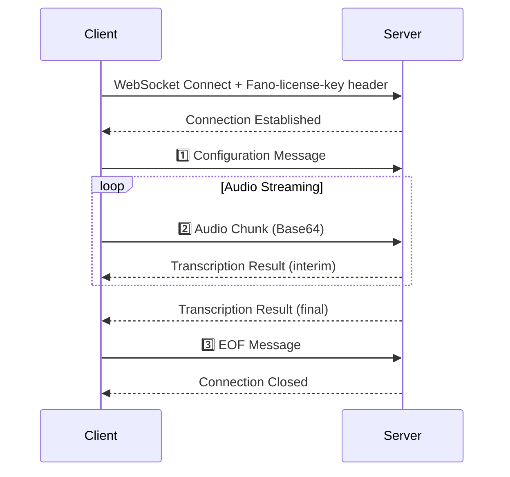

## Overview

Real-time speech-to-text transcription over WebSocket. Optimized for low-latency applications.

| Feature | Description |
|---------|-------------|
| **Protocol** | WebSocket (WSS) |
| **Latency** | < 300ms typical |
| **Languages** | Cantonese, Mandarin, English, Multilingual |
| **Audio Format** | LINEAR16 (PCM) or MULAW |

---

## Endpoint

```
wss://app.fano.ai/api/v1/speech-to-text/streaming-transcript
```

---

## Authentication

<Info>
**Required Header**: Include `Fano-license-key` in the WebSocket handshake request.
</Info>

| Header | Value | Required |
|--------|-------|----------|
| `Fano-license-key` | Your API license key | ✅ Yes |

---

## Message Flow



---

## Client → Server Messages

### 1️⃣ Configuration Message

Send **immediately after connecting** to initialize the session.

<ParamField body="config.languageCode" type="string" required>
  | Code | Language | Description |
  |------|----------|-------------|
  | `yue` | Cantonese | Hong Kong, Guangdong |
  | `cmn` | Mandarin | Mainland China, Taiwan |
  | `en` | English | International |
  | `yue-x-auto` | Multilingual | Auto-detect mixed languages |
</ParamField>

<ParamField body="config.sampleRateHertz" type="integer" required>
  Audio sample rate: `8000` - `48000` Hz. **Recommended: `16000`**
</ParamField>

<ParamField body="config.encoding" type="string" required>
  | Value | Description |
  |-------|-------------|
  | `LINEAR16` | PCM 16-bit signed little-endian ✅ Recommended |
  | `MULAW` | 8-bit μ-law |
</ParamField>

<ParamField body="config.enableAutomaticPunctuation" type="boolean" default="false">
  Add punctuation marks to results
</ParamField>

<ParamField body="config.interimResults" type="boolean" default="false">
  Return interim (tentative) results
</ParamField>

<ParamField body="config.speechContexts.keywords" type="string[]">
  Keywords to boost recognition (max 1000)
</ParamField>

---

### 2️⃣ Audio Chunk Message

Stream Base64-encoded audio continuously.

<ParamField body="audioContent" type="string" required>
  Base64-encoded audio data
</ParamField>

<Tip>
**Recommended chunk size**: 100-500ms of audio
- 100ms at 16kHz/16-bit = 3,200 bytes (lowest latency)
- 500ms at 16kHz/16-bit = 16,000 bytes (best accuracy)
</Tip>

---

### 3️⃣ EOF Message

Send to gracefully close the session.

```json
{
  "eof": true
}
```

---

## Server → Client Messages

### Transcription Result

<ResponseField name="results[].isFinal" type="boolean">
  - `false` — Interim result (may change)
  - `true` — Final result (won't change)
</ResponseField>

<ResponseField name="results[].alternatives[].transcript" type="string">
  Transcribed text
</ResponseField>

<ResponseField name="results[].alternatives[].confidence" type="number">
  Confidence score (0.0-1.0). Note: `0.0` for interim results.
</ResponseField>

---

### Error Message

| Code | Description |
|------|-------------|
| `3` | Invalid argument |
| `400` | Bad request |
| `401` | Unauthorized - check API key |

---

## Code Examples

<Tabs>
  <Tab title="Python">
```python
import asyncio
import websockets
import json
import base64

API_KEY = "YOUR_FANO_LICENSE_KEY"
WS_URL = "wss://app.fano.ai/api/v1/speech-to-text/streaming-transcript"

async def transcribe_audio(audio_file: str):
    async with websockets.connect(
        WS_URL, 
        extra_headers={"Fano-license-key": API_KEY}
    ) as ws:
        
        # 1️⃣ Send configuration
        await ws.send(json.dumps({
            "config": {
                "languageCode": "yue-x-auto",
                "sampleRateHertz": 16000,
                "encoding": "LINEAR16",
                "enableAutomaticPunctuation": True,
                "interimResults": True
            }
        }))

        # 2️⃣ Stream audio chunks
        with open(audio_file, "rb") as f:
            while chunk := f.read(3200):
                await ws.send(json.dumps({
                    "audioContent": base64.b64encode(chunk).decode()
                }))
                
                response = await ws.recv()
                result = json.loads(response)
                if "results" in result:
                    print(result["results"][0]["alternatives"][0]["transcript"])

        # 3️⃣ Send EOF
        await ws.send(json.dumps({"eof": True}))

asyncio.run(transcribe_audio("audio.raw"))
```
  </Tab>
  
  <Tab title="Node.js">
```javascript
const WebSocket = require('ws');
const fs = require('fs');

const API_KEY = 'YOUR_FANO_LICENSE_KEY';
const WS_URL = 'wss://app.fano.ai/api/v1/speech-to-text/streaming-transcript';

const ws = new WebSocket(WS_URL, {
  headers: { 'Fano-license-key': API_KEY }
});

ws.on('open', () => {
  // 1️⃣ Send configuration
  ws.send(JSON.stringify({
    config: {
      languageCode: 'yue-x-auto',
      sampleRateHertz: 16000,
      encoding: 'LINEAR16',
      interimResults: true
    }
  }));

  // 2️⃣ Stream audio
  const audio = fs.readFileSync('audio.raw');
  for (let i = 0; i < audio.length; i += 3200) {
    ws.send(JSON.stringify({
      audioContent: audio.slice(i, i + 3200).toString('base64')
    }));
  }

  // 3️⃣ Send EOF
  ws.send(JSON.stringify({ eof: true }));
});

ws.on('message', (data) => {
  const result = JSON.parse(data);
  if (result.results?.[0]) {
    console.log(result.results[0].alternatives[0].transcript);
  }
});
```
  </Tab>

  <Tab title="wscat (CLI)">
```bash
# Install wscat
npm install -g wscat

# Connect with auth header
wscat -c "wss://app.fano.ai/api/v1/speech-to-text/streaming-transcript" \
  -H "Fano-license-key: YOUR_API_KEY"

# After connected, send:
{"config":{"languageCode":"yue-x-auto","sampleRateHertz":16000,"encoding":"LINEAR16"}}
{"audioContent":"BASE64_AUDIO_DATA"}
{"eof":true}
```
  </Tab>
</Tabs>

---

## Audio Preparation

```bash
# Convert any audio to 16kHz mono PCM
ffmpeg -i input.mp3 -ar 16000 -ac 1 -f s16le output.raw
```

| Requirement | Value |
|-------------|-------|
| Channels | Mono (1 channel) |
| Format | Raw PCM (no headers) |
| Sample Rate | Match `sampleRateHertz` config |
| Bit Depth | 16-bit for LINEAR16 |
