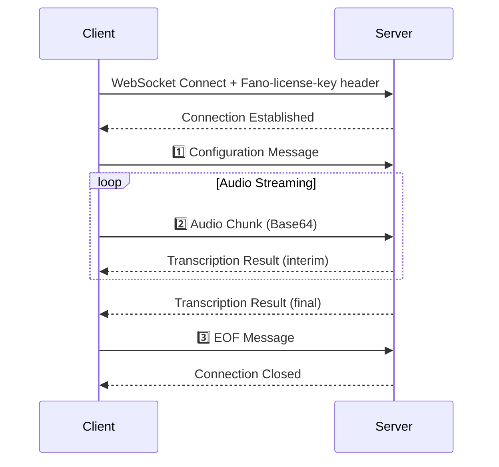

import { WebSocketPlayground } from "/snippets/websocket-playground.jsx"

## Interactive Playground

<WebSocketPlayground />

---

## Overview

Real-time speech-to-text transcription over WebSocket. Optimized for low-latency applications requiring immediate feedback.

| Feature | Description |
|---------|-------------|
| **Protocol** | WebSocket (WSS) |
| **Latency** | < 300ms typical |
| **Languages** | Cantonese, Mandarin, English, Multilingual |
| **Audio Format** | LINEAR16 (PCM) or MULAW |

---

## Endpoint

```
wss://app.fano.ai/api/v1/speech-to-text/streaming-transcript
```

---

## Authentication

<Info>
**Required Header**: Include `Fano-license-key` in the WebSocket handshake request.
</Info>

| Header | Value | Required |
|--------|-------|----------|
| `Fano-license-key` | Your API license key | ✅ Yes |

---

## Message Flow



---

## Client → Server Messages

### 1️⃣ Configuration Message

Send **immediately after connecting** to initialize the session.

<ParamField body="config.languageCode" type="string" required>
  | Code | Language | Description |
  |------|----------|-------------|
  | `yue` | Cantonese | Hong Kong, Guangdong |
  | `cmn` | Mandarin | Mainland China, Taiwan |
  | `en` | English | International |
  | `yue-x-auto` | Multilingual | Auto-detect mixed languages |
</ParamField>

<ParamField body="config.sampleRateHertz" type="integer" required>
  Audio sample rate: `8000` - `48000` Hz. **Recommended: `16000`**
</ParamField>

<ParamField body="config.encoding" type="string" required>
  | Value | Description |
  |-------|-------------|
  | `LINEAR16` | PCM 16-bit signed little-endian ✅ Recommended |
  | `MULAW` | 8-bit μ-law |
</ParamField>

<ParamField body="config.enableAutomaticPunctuation" type="boolean" default="false">
  Add punctuation marks to results
</ParamField>

<ParamField body="config.interimResults" type="boolean" default="false">
  Return interim (tentative) results
</ParamField>

<ParamField body="config.speechContexts.keywords" type="string[]">
  Keywords to boost recognition (max 1000)
</ParamField>

<Accordion title="Example: Minimal Configuration">
```json
{
  "config": {
    "languageCode": "yue",
    "sampleRateHertz": 16000,
    "encoding": "LINEAR16"
  }
}
```
</Accordion>

<Accordion title="Example: Full Configuration">
```json
{
  "config": {
    "languageCode": "yue-x-auto",
    "sampleRateHertz": 16000,
    "encoding": "LINEAR16",
    "enableAutomaticPunctuation": true,
    "interimResults": true,
    "speechContexts": {
      "keywords": ["Fano Labs", "語音識別", "transcription"]
    }
  }
}
```
</Accordion>

---

### 2️⃣ Audio Chunk Message

Stream Base64-encoded audio continuously.

<ParamField body="audioContent" type="string" required>
  Base64-encoded audio data
</ParamField>

<Tip>
**Recommended chunk size**: 100-500ms of audio
- 100ms at 16kHz/16-bit = 3,200 bytes (lowest latency)
- 500ms at 16kHz/16-bit = 16,000 bytes (best accuracy)
</Tip>

```json
{
  "audioContent": "UklGRiQAAABXQVZFZm10IBAAAAABAAEAgD4AAAB9AAACABAAZGF0YQAAAAA="
}
```

---

### 3️⃣ EOF Message

Send to gracefully close the session.

```json
{
  "eof": true
}
```

---

## Server → Client Messages

### Transcription Result

<ResponseField name="results[].isFinal" type="boolean">
  - `false` — Interim result (may change)
  - `true` — Final result (won't change)
</ResponseField>

<ResponseField name="results[].alternatives[].transcript" type="string">
  Transcribed text
</ResponseField>

<ResponseField name="results[].alternatives[].confidence" type="number">
  Confidence score (0.0-1.0). Note: `0.0` for interim results.
</ResponseField>

<Accordion title="Example: Interim Result">
```json
{
  "results": [{
    "alternatives": [{
      "transcript": "你好",
      "confidence": 0.0,
      "languageCode": "yue"
    }],
    "isFinal": false,
    "channelTag": 1
  }]
}
```
</Accordion>

<Accordion title="Example: Final Result">
```json
{
  "results": [{
    "alternatives": [{
      "transcript": "你好，有咩可以幫到你？",
      "confidence": 0.95,
      "startTime": "0.000s",
      "endTime": "2.500s",
      "languageCode": "yue"
    }],
    "isFinal": true,
    "channelTag": 1,
    "resultEndTime": "2.500s"
  }],
  "metadata": {
    "asrModels": ["cantonese-v2"]
  }
}
```
</Accordion>

---

### Error Message

```json
{
  "error": {
    "code": 3,
    "message": "invalid languageCode: must be one of yue, cmn, en, yue-x-auto"
  }
}
```

| Code | Description |
|------|-------------|
| `3` | Invalid argument |
| `400` | Bad request |
| `401` | Unauthorized - check API key |

---

## Code Examples

<Tabs>
  <Tab title="Python">
```python
import asyncio
import websockets
import json
import base64

API_KEY = "YOUR_FANO_LICENSE_KEY"
WS_URL = "wss://app.fano.ai/api/v1/speech-to-text/streaming-transcript"

async def transcribe_audio(audio_file: str):
    """Stream audio file and print transcription results."""
    
    async with websockets.connect(
        WS_URL, 
        extra_headers={"Fano-license-key": API_KEY}
    ) as ws:
        
        # 1️⃣ Send configuration
        await ws.send(json.dumps({
            "config": {
                "languageCode": "yue-x-auto",
                "sampleRateHertz": 16000,
                "encoding": "LINEAR16",
                "enableAutomaticPunctuation": True,
                "interimResults": True
            }
        }))
        print("✅ Connected and configured")

        # 2️⃣ Stream audio chunks
        chunk_size = 3200  # 100ms at 16kHz
        with open(audio_file, "rb") as f:
            while chunk := f.read(chunk_size):
                await ws.send(json.dumps({
                    "audioContent": base64.b64encode(chunk).decode()
                }))
                
                # Check for results
                try:
                    response = await asyncio.wait_for(ws.recv(), timeout=0.05)
                    result = json.loads(response)
                    
                    if "results" in result:
                        text = result["results"][0]["alternatives"][0]["transcript"]
                        is_final = result["results"][0].get("isFinal", False)
                        print(f"{'✅' if is_final else '⏳'} {text}")
                        
                except asyncio.TimeoutError:
                    pass

        # 3️⃣ Send EOF
        await ws.send(json.dumps({"eof": True}))
        print("✅ EOF sent")
        
        # Get remaining results
        async for msg in ws:
            result = json.loads(msg)
            if "results" in result and result["results"][0].get("isFinal"):
                text = result["results"][0]["alternatives"][0]["transcript"]
                print(f"✅ Final: {text}")

# Run: python script.py
asyncio.run(transcribe_audio("audio.raw"))
```
  </Tab>
  
  <Tab title="Node.js">
```javascript
const WebSocket = require('ws');
const fs = require('fs');

const API_KEY = 'YOUR_FANO_LICENSE_KEY';
const WS_URL = 'wss://app.fano.ai/api/v1/speech-to-text/streaming-transcript';

function transcribeAudio(audioFile) {
  const ws = new WebSocket(WS_URL, {
    headers: { 'Fano-license-key': API_KEY }
  });

  ws.on('open', () => {
    console.log('✅ Connected');
    
    // 1️⃣ Send configuration
    ws.send(JSON.stringify({
      config: {
        languageCode: 'yue-x-auto',
        sampleRateHertz: 16000,
        encoding: 'LINEAR16',
        enableAutomaticPunctuation: true,
        interimResults: true
      }
    }));

    // 2️⃣ Stream audio
    const audio = fs.readFileSync(audioFile);
    const chunkSize = 3200;
    
    for (let i = 0; i < audio.length; i += chunkSize) {
      ws.send(JSON.stringify({
        audioContent: audio.slice(i, i + chunkSize).toString('base64')
      }));
    }

    // 3️⃣ Send EOF
    ws.send(JSON.stringify({ eof: true }));
    console.log('✅ EOF sent');
  });

  ws.on('message', (data) => {
    const result = JSON.parse(data);
    if (result.results?.[0]) {
      const text = result.results[0].alternatives[0].transcript;
      const isFinal = result.results[0].isFinal;
      console.log(`${isFinal ? '✅' : '⏳'} ${text}`);
    }
    if (result.error) {
      console.error('❌ Error:', result.error.message);
    }
  });

  ws.on('close', () => console.log('✅ Closed'));
  ws.on('error', (err) => console.error('❌ Error:', err.message));
}

// Run: node script.js
transcribeAudio('audio.raw');
```
  </Tab>

  <Tab title="wscat (CLI)">
```bash
# Install wscat globally
npm install -g wscat

# Connect with authentication header
wscat -c "wss://app.fano.ai/api/v1/speech-to-text/streaming-transcript" \
  -H "Fano-license-key: YOUR_API_KEY"

# After connected, paste these messages:

# 1️⃣ Configuration
{"config":{"languageCode":"yue-x-auto","sampleRateHertz":16000,"encoding":"LINEAR16","interimResults":true}}

# 2️⃣ Audio (convert your file to base64 first)
# Linux/Mac: base64 -i audio.raw | tr -d '\n'
{"audioContent":"BASE64_ENCODED_AUDIO"}

# 3️⃣ End session
{"eof":true}
```
  </Tab>

  <Tab title="Postman">
```
1. Open Postman → New → WebSocket Request

2. URL: wss://app.fano.ai/api/v1/speech-to-text/streaming-transcript

3. Headers tab → Add:
   Key: Fano-license-key
   Value: YOUR_API_KEY

4. Click "Connect"

5. In Message field, send:

   Step 1 - Config:
   {"config":{"languageCode":"yue-x-auto","sampleRateHertz":16000,"encoding":"LINEAR16"}}

   Step 2 - Audio:
   {"audioContent":"YOUR_BASE64_AUDIO"}

   Step 3 - EOF:
   {"eof":true}
```
  </Tab>
</Tabs>

---

## Audio Preparation

<Warning>
Audio must **exactly match** your configuration settings.
</Warning>

| Requirement | Value |
|-------------|-------|
| Channels | Mono (1 channel) |
| Format | Raw PCM (no headers) |
| Sample Rate | Match `sampleRateHertz` config |
| Bit Depth | 16-bit for LINEAR16 |

### Convert Audio Files

```bash
# Convert any audio to 16kHz mono PCM
ffmpeg -i input.mp3 -ar 16000 -ac 1 -f s16le output.raw

# Convert to Base64 (for testing)
base64 -i output.raw | tr -d '\n' > output.b64
```

---

## Best Practices

<AccordionGroup>
  <Accordion title="Optimal Chunk Size">
    Use **100-250ms** chunks for real-time captioning, **500ms** for higher accuracy.
  </Accordion>
  
  <Accordion title="Handle Interim Results">
    Display interim results immediately, replace with final when received.
  </Accordion>
  
  <Accordion title="Reconnection Strategy">
    Implement exponential backoff. Buffer audio during reconnection.
  </Accordion>
  
  <Accordion title="Use yue-x-auto for Mixed Speech">
    Best for Cantonese/Mandarin/English code-switching conversations.
  </Accordion>
</AccordionGroup>
