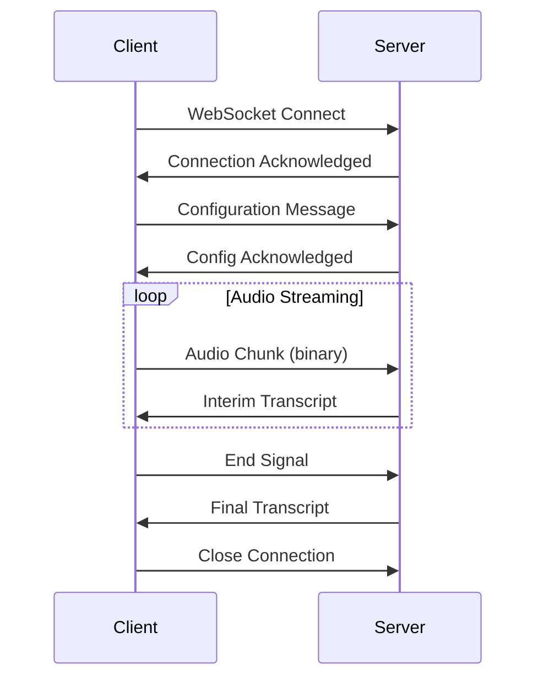

# WebSocket Connection

Connect to the Fano Speech API for real-time streaming transcription.

## Endpoint

```
wss://api.fano.ai/v1/stream
```

## Authentication

Pass your API key as a query parameter:

```
wss://api.fano.ai/v1/stream?api_key=your_api_key_here
```

Or as a header during the WebSocket handshake:

```
Authorization: Bearer your_api_key_here
```

## Connection Flow



## Messages

### Client → Server

#### Configuration Message

Send immediately after connection:

```json
{
  "type": "config",
  "language": "auto",
  "model": "general",
  "punctuation": true,
  "capitalize": true,
  "diarization": false,
  "max_speakers": 2,
  "keywords": ["Fano", "speech API"],
  "keyword_boost": 1.5,
  "interim_results": true
}
```

<ParamField body="type" type="string" required>
  Must be `"config"`.
</ParamField>

<ParamField body="language" type="string" default="auto">
  Language code or `"auto"` for automatic detection.
</ParamField>

<ParamField body="model" type="string" default="general">
  Model to use: `general`, `telephony`, `meeting`, `broadcast`.
</ParamField>

<ParamField body="punctuation" type="boolean" default="true">
  Enable automatic punctuation.
</ParamField>

<ParamField body="capitalize" type="boolean" default="true">
  Enable automatic capitalization.
</ParamField>

<ParamField body="diarization" type="boolean" default="false">
  Enable speaker diarization.
</ParamField>

<ParamField body="max_speakers" type="integer" default="2">
  Maximum speakers to identify (1-8).
</ParamField>

<ParamField body="keywords" type="array">
  Keywords to boost recognition.
</ParamField>

<ParamField body="keyword_boost" type="number" default="1.5">
  Keyword boost strength (1.0-3.0).
</ParamField>

<ParamField body="interim_results" type="boolean" default="true">
  Receive interim (non-final) results.
</ParamField>

#### Audio Data

Send raw audio as binary WebSocket frames:

- **Format**: PCM 16-bit
- **Sample Rate**: 16000 Hz (recommended) or 8000 Hz
- **Channels**: Mono
- **Chunk Size**: 100-500ms recommended

#### End Signal

Signal end of audio stream:

```json
{
  "type": "end"
}
```

### Server → Client

#### Config Acknowledgement

```json
{
  "type": "config_ack",
  "session_id": "sess_abc123"
}
```

#### Transcript

```json
{
  "type": "transcript",
  "text": "Hello world",
  "is_final": false,
  "confidence": 0.92,
  "start": 0.0,
  "end": 1.5,
  "words": [
    {"word": "Hello", "start": 0.0, "end": 0.5, "confidence": 0.95},
    {"word": "world", "start": 0.6, "end": 1.5, "confidence": 0.89}
  ]
}
```

<ResponseField name="type" type="string">
  Always `"transcript"`.
</ResponseField>

<ResponseField name="text" type="string">
  Transcribed text.
</ResponseField>

<ResponseField name="is_final" type="boolean">
  `true` if this is a final result, `false` for interim.
</ResponseField>

<ResponseField name="confidence" type="number">
  Confidence score (0-1).
</ResponseField>

<ResponseField name="start" type="number">
  Start time in seconds.
</ResponseField>

<ResponseField name="end" type="number">
  End time in seconds.
</ResponseField>

<ResponseField name="words" type="array">
  Word-level details (if enabled).
</ResponseField>

#### Speaker Change

When diarization is enabled:

```json
{
  "type": "speaker",
  "speaker_id": 1,
  "start": 2.5,
  "text": "This is speaker one talking."
}
```

#### Error

```json
{
  "type": "error",
  "code": "AUDIO_FORMAT_ERROR",
  "message": "Invalid audio format. Expected PCM 16-bit."
}
```

## Code Examples

<CodeGroup>

```python Python
import websocket
import json
import threading
import pyaudio

API_KEY = "your_api_key_here"
WS_URL = f"wss://api.fano.ai/v1/stream?api_key={API_KEY}"

# Audio settings
RATE = 16000
CHUNK = int(RATE * 0.25)  # 250ms chunks
FORMAT = pyaudio.paInt16

class StreamingTranscriber:
    def __init__(self):
        self.ws = None
        self.audio = pyaudio.PyAudio()
        
    def on_message(self, ws, message):
        data = json.loads(message)
        if data["type"] == "transcript":
            prefix = "[FINAL]" if data["is_final"] else "[INTERIM]"
            print(f"{prefix} {data['text']}")
    
    def on_open(self, ws):
        # Send configuration
        config = {
            "type": "config",
            "language": "auto",
            "model": "general",
            "punctuation": True,
            "interim_results": True
        }
        ws.send(json.dumps(config))
        
        # Start audio capture in separate thread
        threading.Thread(target=self.stream_audio).start()
    
    def stream_audio(self):
        stream = self.audio.open(
            format=FORMAT,
            channels=1,
            rate=RATE,
            input=True,
            frames_per_buffer=CHUNK
        )
        
        print("Recording... Press Ctrl+C to stop")
        try:
            while True:
                data = stream.read(CHUNK)
                self.ws.send(data, opcode=websocket.ABNF.OPCODE_BINARY)
        except KeyboardInterrupt:
            self.ws.send(json.dumps({"type": "end"}))
            stream.close()
    
    def run(self):
        self.ws = websocket.WebSocketApp(
            WS_URL,
            on_message=self.on_message,
            on_open=self.on_open,
            on_error=lambda ws, e: print(f"Error: {e}"),
            on_close=lambda ws, c, m: print("Connection closed")
        )
        self.ws.run_forever()

if __name__ == "__main__":
    transcriber = StreamingTranscriber()
    transcriber.run()
```

```javascript JavaScript
const API_KEY = 'your_api_key_here';
const WS_URL = `wss://api.fano.ai/v1/stream?api_key=${API_KEY}`;

let ws;
let mediaRecorder;

function connect() {
  ws = new WebSocket(WS_URL);
  
  ws.onopen = () => {
    console.log('Connected');
    
    // Send configuration
    ws.send(JSON.stringify({
      type: 'config',
      language: 'auto',
      model: 'general',
      punctuation: true,
      interim_results: true
    }));
    
    // Start audio capture
    startAudioCapture();
  };
  
  ws.onmessage = (event) => {
    const data = JSON.parse(event.data);
    
    if (data.type === 'transcript') {
      const prefix = data.is_final ? '[FINAL]' : '[INTERIM]';
      console.log(`${prefix} ${data.text}`);
      
      // Update UI
      document.getElementById('transcript').textContent = data.text;
    }
  };
  
  ws.onerror = (error) => {
    console.error('WebSocket error:', error);
  };
  
  ws.onclose = () => {
    console.log('Connection closed');
  };
}

async function startAudioCapture() {
  const stream = await navigator.mediaDevices.getUserMedia({ 
    audio: {
      sampleRate: 16000,
      channelCount: 1
    }
  });
  
  // Create AudioContext for PCM conversion
  const audioContext = new AudioContext({ sampleRate: 16000 });
  const source = audioContext.createMediaStreamSource(stream);
  const processor = audioContext.createScriptProcessor(4096, 1, 1);
  
  processor.onaudioprocess = (e) => {
    const inputData = e.inputBuffer.getChannelData(0);
    const pcmData = new Int16Array(inputData.length);
    
    for (let i = 0; i < inputData.length; i++) {
      pcmData[i] = Math.max(-32768, Math.min(32767, inputData[i] * 32768));
    }
    
    if (ws.readyState === WebSocket.OPEN) {
      ws.send(pcmData.buffer);
    }
  };
  
  source.connect(processor);
  processor.connect(audioContext.destination);
}

function stopRecording() {
  if (ws && ws.readyState === WebSocket.OPEN) {
    ws.send(JSON.stringify({ type: 'end' }));
  }
}

// Start connection
connect();
```

</CodeGroup>

## Error Codes

| Code | Description |
|------|-------------|
| `INVALID_CONFIG` | Invalid configuration message |
| `AUDIO_FORMAT_ERROR` | Audio format not supported |
| `RATE_LIMITED` | Too many concurrent connections |
| `CONNECTION_TIMEOUT` | No audio received within timeout |
| `INTERNAL_ERROR` | Server-side processing error |

## Best Practices

<Tip>
**For low-latency transcription:**
- Use 100-250ms audio chunks
- Enable interim results for immediate feedback
- Use a stable network connection
- Implement reconnection logic
</Tip>

<Warning>
**Connection limits:**
- Maximum connection duration: 4 hours
- Idle timeout: 30 seconds (no audio received)
- Maximum concurrent connections: Based on your plan
</Warning>
