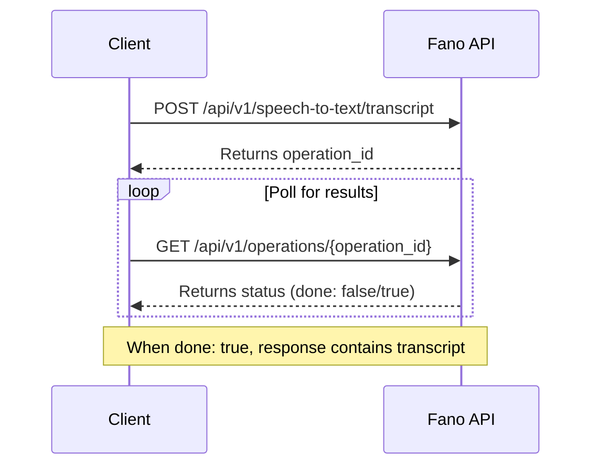

## Overview

The Fano Asynchronous Speech-to-Text (STT) API allows you to transcribe longer audio files. It's designed for processing large audio files, such as call recordings, interviews, lectures, and media files, where you don't need an immediate, real-time response.

## How It Works



The asynchronous transcription process is a simple, two-step workflow:
1. **Submit the file:** You send a `POST` request to the `/api/v1/speech-to-text/transcript` endpoint with your audio file (as a URI or base64-encoded string) and configuration.
2. **Get the transcript:** The API returns an `operation_id`. You can then get the transcription results by polling, in which you could periodically check a `GET` endpoint using the `operation_id` until the transcription is `done`.

## Full Example Code

<CodeGroup>

```python Python
import requests
import time

# --- Configuration ---
API_KEY = "YOUR_LICENSE_KEY_HERE"
BASE_URL = "https://app.fanocloud.com"
AUDIO_FILE_URI = "https://your-bucket.s3.aws.com/audio/my-long-call.wav"

HEADERS = {
    "Fano-license-key": API_KEY,
    "Content-Type": "application/json"
}

# --- 1. Submit the transcription job ---
def submit_job(audio_uri):
    """
    Submits a new transcription job to the long-running API.
    """
    submit_url = f"{BASE_URL}/api/v1/speech-to-text/transcript"
    
    payload = {
        "config": {
            "languageCode": "yue-x-auto",
            "encoding": "LINEAR16",
            "enableAutomaticPunctuation": True
        },
        "audio": {
            "uri": audio_uri
        }
    }
    
    try:
        response = requests.post(submit_url, headers=HEADERS, json=payload)
        response.raise_for_status()
        
        data = response.json()
        operation_id = data.get("name")
        
        if not operation_id:
            print("Error: Could not get operation ID from response.")
            print("Response:", data)
            return None
            
        print(f"Job submitted successfully. Operation ID: {operation_id}")
        return operation_id
        
    except requests.exceptions.RequestException as e:
        print(f"Error submitting job: {e}")
        return None

# --- 2. Poll for the results ---
def get_results(operation_id):
    """
    Polls the operations endpoint for the status of a job.
    """
    poll_url = f"{BASE_URL}/api/v1/operations/{operation_id}"
    
    try:
        response = requests.get(poll_url, headers=HEADERS)
        response.raise_for_status()
        return response.json()
        
    except requests.exceptions.RequestException as e:
        print(f"Error polling for results: {e}")
        return None

# --- Main polling logic ---
if __name__ == "__main__":
    op_id = submit_job(AUDIO_FILE_URI)
    
    if op_id:
        while True:
            result = get_results(op_id)
            
            if not result:
                print("Polling failed. Exiting.")
                break
                
            is_done = result.get("done", False)
            
            if is_done:
                print("\nTranscription Complete!")
                if "response" in result:
                    import json
                    print(json.dumps(result["response"], indent=2))
                elif "error" in result:
                    print(f"Job failed with error: {result['error']}")
                break
            else:
                print("Job is not done yet. Waiting 10 seconds...")
                time.sleep(10)
```

```javascript JavaScript
// --- Configuration ---
const API_KEY = "YOUR_LICENSE_KEY_HERE";
const BASE_URL = "https://app.fanocloud.com";
const AUDIO_FILE_URI = "https://your-bucket.s3.aws.com/audio/my-long-call.wav";
const POLLING_INTERVAL_MS = 10000;

const HEADERS = {
    "Fano-license-key": API_KEY,
    "Content-Type": "application/json"
};

const sleep = (ms) => new Promise(resolve => setTimeout(resolve, ms));

// --- 1. Submit the transcription job ---
async function submitJob(audioUri) {
    const submitUrl = `${BASE_URL}/api/v1/speech-to-text/transcript`;
    
    const payload = {
        "config": {
            "languageCode": "yue-x-auto",
            "encoding": "LINEAR16",
            "enableAutomaticPunctuation": true
        },
        "audio": {
            "uri": audioUri
        }
    };

    try {
        const response = await fetch(submitUrl, {
            method: 'POST',
            headers: HEADERS,
            body: JSON.stringify(payload)
        });

        if (!response.ok) {
            throw new Error(`HTTP error! status: ${response.status}`);
        }

        const data = await response.json();
        const operationId = data.name;

        if (!operationId) {
            console.error("Error: Could not get operation ID from response.", data);
            return null;
        }

        console.log(`Job submitted successfully. Operation ID: ${operationId}`);
        return operationId;

    } catch (error) {
        console.error("Error submitting job:", error);
        return null;
    }
}

// --- 2. Poll for the results ---
async function getResults(operationId) {
    const pollUrl = `${BASE_URL}/api/v1/operations/${operationId}`;

    try {
        const response = await fetch(pollUrl, { headers: HEADERS });

        if (!response.ok) {
            throw new Error(`HTTP error! status: ${response.status}`);
        }

        return await response.json();

    } catch (error) {
        console.error("Error polling for results:", error);
        return null;
    }
}

// --- Main polling logic ---
async function main() {
    try {
        const opId = await submitJob(AUDIO_FILE_URI);

        if (!opId) return;

        while (true) {
            const result = await getResults(opId);

            if (!result) {
                console.log("Polling failed. Exiting.");
                break;
            }

            if (result.done) {
                console.log("\nTranscription Complete!");
                if (result.response) {
                    console.log(JSON.stringify(result.response, null, 2));
                } else if (result.error) {
                    console.error(`Job failed with error:`, result.error);
                }
                break;
            } else {
                console.log("Job is not done yet. Waiting 10 seconds...");
                await sleep(POLLING_INTERVAL_MS);
            }
        }
    } catch (error) {
        console.error("An unexpected error occurred:", error);
    }
}

main();
```

</CodeGroup>

## Quick Start

### Before You Begin: Authentication

All requests to the Fano Speech API must be authenticated using your license key. Pass the key in the request header as `Fano-license-key`.

```
Fano-license-key: YOUR_LICENSE_KEY_HERE
```

### Step 1: Submit a File for Transcription

To start a new transcription job, make a `POST` request to the asynchronous endpoint.

<Note>
**Endpoint:** `POST /api/v1/speech-to-text/transcript`
</Note>

**Request Body:**

```json
{
  "config": {
    "languageCode": "yue-x-auto",
    "encoding": "LINEAR16",
    "enableAutomaticPunctuation": true
  },
  "audio": {
    "uri": "{audio_uri}"
  }
}
```

### Step 2: Get the Results

Use the `name` from the response to poll the operations endpoint.

<Note>
**Endpoint:** `GET /api/v1/operations/{operation_id}`
</Note>

**Response (Job in Progress):**

While the job is processing, `done` will remain `false` and there will be no `response` object.

```json
{
  "name": "{job_id}",
  "done": false,
  "metadata": {
    "requestTime": "2025-08-19T07:50:23.692Z",
    "startTime": "2025-08-19T07:50:23.692Z",
    "endTime": null
  }
}
```

**Response (Job Complete):**

When the job is finished, `done` will be `true` and the object will contain the full `response` with your transcript.

```json
{
  "name": "2a0ffe84-f98b-47dc-a55b-963a2e01ba29",
  "metadata": {
    "requestTime": "2025-08-19T07:50:23.692Z",
    "startTime": "2025-08-19T07:50:23.692Z",
    "endTime": "2025-08-19T07:54:06.028Z"
  },
  "done": true,
  "response": {
    "results": [
      {
        "alternatives": [
          {
            "transcript": "hello, how can i help you? ",
            "confidence": 0.9227743,
            "start_time": "1.200000048s",
            "end_time": "1.600000024s",
            "speaker_tag": "1",
            "language_code": "en"
          }
        ],
        "channel_tag": 1
      },
      {
        "alternatives": [
          {
            "transcript": "wait a min, i need to check with my account status",
            "confidence": 0.9464005,
            "start_time": "3.960000038s",
            "end_time": "5.719999790s",
            "speaker_tag": "2",
            "language_code": "en"
          }
        ],
        "channel_tag": 1
      }
    ]
  }
}
```

## Audio Requirements

### Supported Audio Formats and Encoding

| Audio Format | Encoding | Description |
|--------------|----------|-------------|
| WAV | LINEAR16 | 16-bit PCM (recommended) |
| WAV | MULAW | 8-bit μ-law |
| MP3 | MP3 | MPEG Audio Layer III |
| FLAC | FLAC | Free Lossless Audio Codec |
| OGG | OGG_OPUS | Ogg Opus |
| AAC | AAC | Advanced Audio Coding |

### Other Requirements

- **Sample Rate:** 8,000 - 48,000 Hz (16,000 Hz recommended)
- **Channels:** Mono & stereo supported
