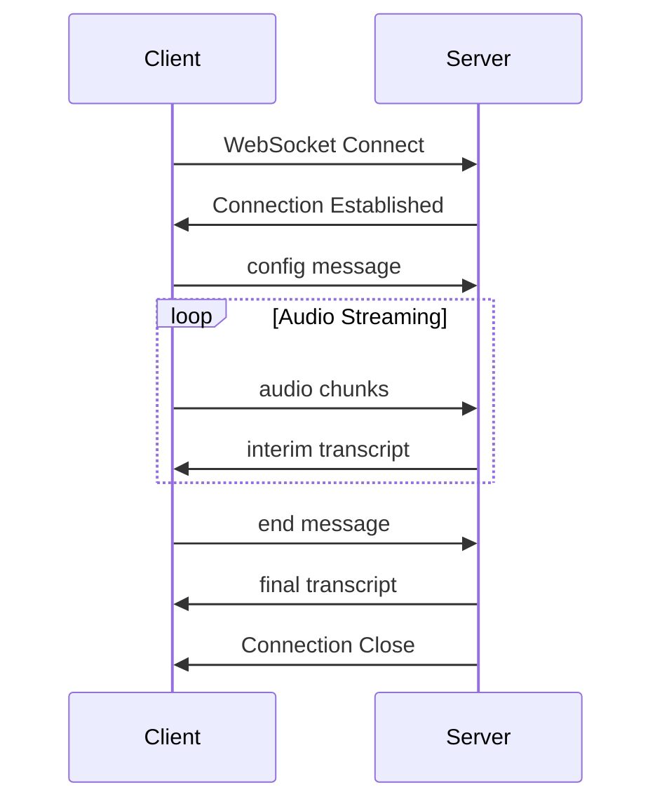

# Transcribe Streaming Audio

This guide shows you how to set up real-time audio transcription using WebSocket connections with the Fano Speech API.

## Overview

Streaming transcription allows you to receive transcripts in real-time as audio is being recorded. This is ideal for:

- Live captioning
- Real-time meeting transcription
- Voice-controlled applications
- Call center analytics

## Prerequisites

- A valid Fano Speech API key
- WebSocket client library for your programming language
- Audio capture capability (microphone or audio stream)

## WebSocket Connection

Connect to the WebSocket endpoint:

```
wss://api.fano.ai/v1/stream
```

## Quick Start

<CodeGroup>

```python Python
import websocket
import json
import pyaudio

API_KEY = "your_api_key_here"
WS_URL = f"wss://api.fano.ai/v1/stream?api_key={API_KEY}"

def on_message(ws, message):
    data = json.loads(message)
    if data.get("type") == "transcript":
        print(f"Transcript: {data['text']}")
        if data.get("is_final"):
            print("--- Final ---")

def on_open(ws):
    # Send configuration
    config = {
        "type": "config",
        "language": "auto",
        "model": "general",
        "punctuation": True
    }
    ws.send(json.dumps(config))
    
    # Start sending audio
    # ... audio capture code here

ws = websocket.WebSocketApp(
    WS_URL,
    on_message=on_message,
    on_open=on_open
)

ws.run_forever()
```

```javascript JavaScript
const API_KEY = 'your_api_key_here';
const WS_URL = `wss://api.fano.ai/v1/stream?api_key=${API_KEY}`;

const ws = new WebSocket(WS_URL);

ws.onopen = () => {
  // Send configuration
  ws.send(JSON.stringify({
    type: 'config',
    language: 'auto',
    model: 'general',
    punctuation: true
  }));
  
  // Start sending audio chunks
  startAudioCapture();
};

ws.onmessage = (event) => {
  const data = JSON.parse(event.data);
  if (data.type === 'transcript') {
    console.log(`Transcript: ${data.text}`);
    if (data.is_final) {
      console.log('--- Final ---');
    }
  }
};

function startAudioCapture() {
  navigator.mediaDevices.getUserMedia({ audio: true })
    .then(stream => {
      const mediaRecorder = new MediaRecorder(stream);
      mediaRecorder.ondataavailable = (e) => {
        ws.send(e.data);
      };
      mediaRecorder.start(250); // Send chunks every 250ms
    });
}
```

</CodeGroup>

## Message Types

### Client to Server

<AccordionGroup>
  <Accordion title="config" icon="gear">
    Initial configuration message sent after connection.
    
    ```json
    {
      "type": "config",
      "language": "auto",
      "model": "general",
      "punctuation": true,
      "diarization": false,
      "keywords": ["Fano", "speech", "API"]
    }
    ```
  </Accordion>
  
  <Accordion title="audio" icon="waveform">
    Binary audio data. Send raw PCM audio chunks (16-bit, 16kHz, mono).
  </Accordion>
  
  <Accordion title="end" icon="stop">
    Signal end of audio stream.
    
    ```json
    {
      "type": "end"
    }
    ```
  </Accordion>
</AccordionGroup>

### Server to Client

<AccordionGroup>
  <Accordion title="transcript" icon="text">
    Transcription result (interim or final).
    
    ```json
    {
      "type": "transcript",
      "text": "Hello world",
      "is_final": false,
      "confidence": 0.92,
      "words": [
        {"word": "Hello", "start": 0.0, "end": 0.5},
        {"word": "world", "start": 0.6, "end": 1.0}
      ]
    }
    ```
  </Accordion>
  
  <Accordion title="speaker" icon="user">
    Speaker identification event (when diarization is enabled).
    
    ```json
    {
      "type": "speaker",
      "speaker_id": 1,
      "start": 0.0,
      "end": 2.5
    }
    ```
  </Accordion>
  
  <Accordion title="error" icon="triangle-exclamation">
    Error message.
    
    ```json
    {
      "type": "error",
      "code": "AUDIO_FORMAT_ERROR",
      "message": "Unsupported audio format"
    }
    ```
  </Accordion>
</AccordionGroup>

## Audio Requirements

<Info>
For best results, use the following audio settings:
- **Sample Rate**: 16kHz (recommended) or 8kHz
- **Bit Depth**: 16-bit
- **Channels**: Mono
- **Format**: Raw PCM or WAV
</Info>

| Setting | Value |
|---------|-------|
| Sample Rate | 16000 Hz |
| Bit Depth | 16-bit |
| Channels | 1 (Mono) |
| Chunk Size | 250ms recommended |

## Connection Lifecycle



## Error Handling

<Warning>
Always implement reconnection logic for production applications. WebSocket connections can be interrupted by network issues.
</Warning>

```python
import time

def connect_with_retry(max_retries=5):
    retries = 0
    while retries < max_retries:
        try:
            ws = websocket.WebSocketApp(WS_URL, ...)
            ws.run_forever()
        except Exception as e:
            retries += 1
            wait_time = min(2 ** retries, 30)  # Exponential backoff
            print(f"Connection failed, retrying in {wait_time}s...")
            time.sleep(wait_time)
```

## Best Practices

<Tip>
**Latency Optimization Tips:**
- Use smaller audio chunks (100-250ms) for lower latency
- Process interim results for immediate feedback
- Use a stable, low-latency network connection
</Tip>

## Next Steps

<CardGroup cols={2}>
  <Card title="Keyword Biasing" icon="bullseye" href="/docs/features/keyword-biasing">
    Boost recognition for specific terms
  </Card>
  <Card title="Speaker Diarization" icon="users" href="/docs/features/speaker-diarization">
    Identify multiple speakers
  </Card>
</CardGroup>
