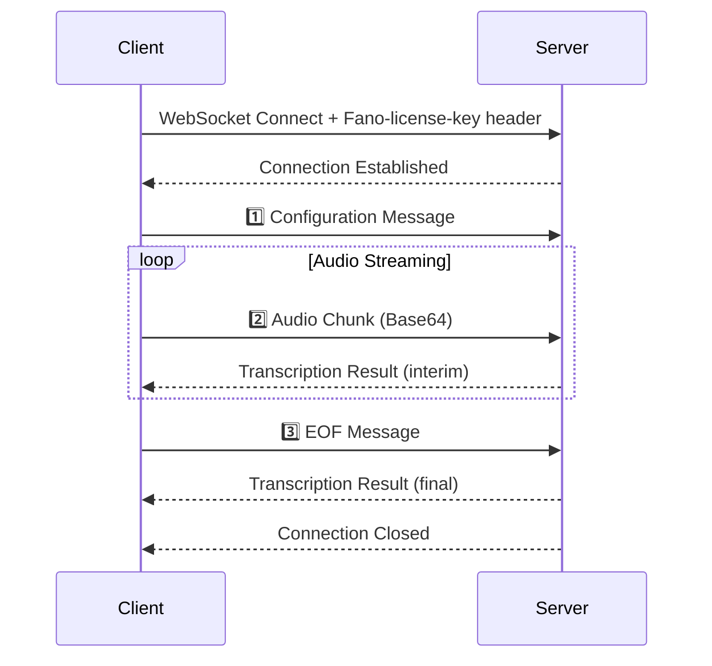

## Overview

The Fano Speech API Streaming endpoint allows you to transcribe audio in real-time with low latency.

**Common Use Cases:**

- **Live Agent Assist:** Transcribe contact center calls in real-time to trigger compliance alerts.
- **Meeting Transcription:** Live notetaking for Cantonese, Mandarin, and English meetings.

## How It Works


```mermaid
sequenceDiagram
    participant Client
    participant Server
    
    Client->>Server: WebSocket Connect + Fano-license-key header
    Server-->>Client: Connection Established
    
    Client->>Server: 1️⃣ Configuration Message
    
    loop Audio Streaming
        Client->>Server: 2️⃣ Audio Chunk (Base64)
        Server-->>Client: Transcription Result (interim)
    end
    
    Client->>Server: 3️⃣ EOF Message
    Server-->>Client: Transcription Result (final)
    Server-->>Client: Connection Closed
```


### Prerequisites

- **Fano API Key:** Obtainable from the Developer Portal.

### Connection Protocol

We use **Secure WebSockets (WSS)** for streaming. This allows for a persistent, bi-directional connection where you stream audio chunks and receive JSON transcription events asynchronously.

**Base URL:**

```
wss://app.fanocloud.com/api/v1/speech-to-text/streaming-transcript
```

### Example Code

<CodeGroup>

```python Python
# pip install "websockets>=14" pyaudio
import asyncio
import base64
import json

import pyaudio
import websockets

# CONFIGURATION
API_KEY = "YOUR_FANO_API_KEY"
URL = "wss://app.fanocloud.com/api/v1/speech-to-text/streaming-transcript"
SAMPLE_RATE = 16000
CHUNK_FRAMES = 1600  # 100 ms of 16 kHz mono audio
DURATION_SECONDS = 30


async def stream_audio():
    # 1. Authenticate with the Fano-License-Key header
    headers = {"Fano-License-Key": API_KEY}

    config_msg = {
        "config": {
            "languageCode": "yue-x-auto",
            "sampleRateHertz": SAMPLE_RATE,
            "encoding": "LINEAR16",
            "enableAutomaticPunctuation": True,
            "interimResults": True,
        }
    }

    async with websockets.connect(URL, additional_headers=headers) as ws:
        # 2. Send Configuration
        await ws.send(json.dumps(config_msg))
        print("Connected to Fano Streaming API...")

        # 3. Setup Microphone Stream (PyAudio, 16-bit mono PCM)
        p = pyaudio.PyAudio()
        stream = p.open(
            format=pyaudio.paInt16,
            channels=1,
            rate=SAMPLE_RATE,
            input=True,
            frames_per_buffer=CHUNK_FRAMES,
        )

        async def send_audio():
            for _ in range(DURATION_SECONDS * SAMPLE_RATE // CHUNK_FRAMES):
                data = await asyncio.to_thread(
                    stream.read, CHUNK_FRAMES, exception_on_overflow=False
                )
                # Audio is sent as Base64 inside a JSON message, not as binary frames
                await ws.send(json.dumps({"audioContent": base64.b64encode(data).decode()}))

            # 4. Send EOF; the server closes the connection after the final results
            await ws.send(json.dumps({"eof": True}))
            stream.stop_stream()
            stream.close()
            p.terminate()

        async def receive_transcripts():
            async for message in ws:
                response = json.loads(message)
                if "error" in response:
                    print(f"Error {response['error'].get('code')}: {response['error'].get('message')}")
                    continue
                for result in response.get("results", []):
                    transcript = result["alternatives"][0]["transcript"]
                    if result.get("isFinal"):
                        print(f"Final: {transcript}")
                    else:
                        print(f"Interim: {transcript}", end="\r")

        # Run send and receive loops concurrently
        await asyncio.gather(send_audio(), receive_transcripts())


asyncio.run(stream_audio())
```

```javascript Node.js
// npm install ws node-record-lpcm16  (requires SoX for microphone capture)
const WebSocket = require('ws');
const record = require('node-record-lpcm16');

// CONFIGURATION
const API_KEY = 'YOUR_FANO_API_KEY';
const URL = 'wss://app.fanocloud.com/api/v1/speech-to-text/streaming-transcript';
const DURATION_MS = 30000;

// 1. Authenticate with the Fano-License-Key header
const ws = new WebSocket(URL, {
  headers: { 'Fano-License-Key': API_KEY }
});

let recording;

ws.on('open', () => {
  console.log('Connected to Fano Streaming API...');

  // 2. Send Configuration
  const configMsg = {
    config: {
      languageCode: 'yue-x-auto',
      sampleRateHertz: 16000,
      encoding: 'LINEAR16',
      enableAutomaticPunctuation: true,
      interimResults: true
    }
  };
  ws.send(JSON.stringify(configMsg));

  // 3. Stream microphone audio (16-bit mono PCM) as Base64 inside JSON
  recording = record.record({ sampleRate: 16000, channels: 1, audioType: 'raw' });
  recording.stream().on('data', (chunk) => {
    if (ws.readyState === WebSocket.OPEN) {
      ws.send(JSON.stringify({ audioContent: chunk.toString('base64') }));
    }
  });

  // 4. Send EOF; the server closes the connection after the final results
  setTimeout(() => {
    recording.stop();
    ws.send(JSON.stringify({ eof: true }));
  }, DURATION_MS);
});

ws.on('message', (data) => {
  const response = JSON.parse(data);

  if (response.error) {
    console.error(`Error ${response.error.code}: ${response.error.message}`);
    return;
  }

  for (const result of response.results ?? []) {
    const transcript = result.alternatives?.[0]?.transcript;

    if (result.isFinal) {
      console.log(`Final: ${transcript}`);
    } else {
      process.stdout.write(`Interim: ${transcript}\r`);
    }
  }
});

ws.on('close', () => {
  console.log('Connection closed');
  recording?.stop();
});

ws.on('error', (error) => {
  console.error('WebSocket Error:', error);
});
```

```javascript Browser
// CONFIGURATION
const API_KEY = 'YOUR_FANO_API_KEY';
const URL = 'wss://app.fanocloud.com/api/v1/speech-to-text/streaming-transcript';

// Browsers cannot set custom headers, so the license key
// is passed via the WebSocket subprotocols instead
const ws = new WebSocket(URL, ['fano-license-key', API_KEY]);

ws.onopen = () => {
  console.log('Connected to Fano Streaming API...');

  // 1. Send Configuration
  const configMsg = {
    config: {
      languageCode: 'yue-x-auto',
      sampleRateHertz: 16000,
      encoding: 'LINEAR16',
      enableAutomaticPunctuation: true,
      interimResults: true
    }
  };
  ws.send(JSON.stringify(configMsg));
};

ws.onmessage = (event) => {
  const response = JSON.parse(event.data);

  if (response.error) {
    console.error(`Error ${response.error.code}: ${response.error.message}`);
    return;
  }

  for (const result of response.results ?? []) {
    const transcript = result.alternatives?.[0]?.transcript;

    if (result.isFinal) {
      console.log(`Final: ${transcript}`);
    } else {
      console.log(`Interim: ${transcript}`);
    }
  }
};

ws.onclose = () => {
  console.log('Connection closed');
};

ws.onerror = (error) => {
  console.error('WebSocket Error:', error);
};

// 2. Send Audio Chunks: call with each 100-500 ms Uint8Array of 16-bit mono PCM
function sendAudioChunk(pcmBytes) {
  ws.send(JSON.stringify({ audioContent: btoa(String.fromCharCode(...pcmBytes)) }));
}

// 3. Send EOF when the stream is finished; the server sends the
// final results and then closes the connection
function stopStreaming() {
  ws.send(JSON.stringify({ eof: true }));
}
```

</CodeGroup>

## Quick Start

### Step 1: Authentication

Authentication is handled via the `Fano-license-key` header during the WebSocket handshake.

| Header | Value | Description |
|--------|-------|-------------|
| `Fano-license-key` | `YOUR_API_KEY` | Your unique license key provided by Fano Labs. |

<Note>
Browser JavaScript cannot set custom headers on WebSocket connections. In the browser, pass the license key via the WebSocket subprotocols instead: `new WebSocket(url, ['fano-license-key', licenseKey])`.
</Note>

### Step 2: Connection Workflow

The streaming session follows a strict lifecycle:

<Steps>
  <Step title="Establish Connection">
    Connect to the WebSocket endpoint:
    ```
    wss://app.fanocloud.com/api/v1/speech-to-text/streaming-transcript
    ```
  </Step>
  <Step title="Send Configuration (Publish Event)">
    Immediately after connecting, send the configuration event to initialize the session.

    ```json
    {
      "config": {
        "languageCode": "yue-x-auto",
        "sampleRateHertz": 16000,
        "encoding": "LINEAR16"
      }
    }
    ```
  </Step>
  <Step title="Send Audio Chunks">
    Audio must be chunked (recommended 100ms - 500ms size), Base64 encoded, and wrapped in a JSON object.

    ```json
    {
      "audioContent": "<BASE64_ENCODED_AUDIO_STRING>"
    }
    ```
  </Step>
  <Step title="Receive Real-Time Results">
    The server will push JSON messages containing partial or final transcripts.

    ```json
    {
      "results": [
        {
          "alternatives": [
            {
              "transcript": "Hello, how can I help you today?",
              "confidence": 0.95,
              "startTime": "0.000s",
              "endTime": "3.200s",
              "languageCode": "en"
            }
          ],
          "resultEndTime": "0.031s",
          "channelTag": 1,
          "isFinal": false
        }
      ],
      "metadata": {
        "asrModels": ["model_1", "model_2"]
      }
    }
    ```

    <Note>
    `isFinal: false` indicates an interim result (can change). `isFinal: true` indicates the sentence is committed.
    </Note>
  </Step>
  <Step title="Send EOF">
    When the stream is finished, send the stop event to close the session gracefully.

    ```json
    {
      "eof": true
    }
    ```
  </Step>
</Steps>

## Error Handling

Errors are sent over the open WebSocket as a JSON message, after which the server closes the connection:

```json
{
  "error": {
    "code": 16,
    "message": "license key is empty"
  }
}
```

The `code` field is a [gRPC status code](https://grpc.io/docs/guides/status-codes/):

| Code | Name | Troubleshooting |
|------|------|-----------------|
| `16` | Unauthenticated | Check your `Fano-license-key`. |
| `3` | InvalidArgument | Check your JSON format, config fields or Base64 encoding. |
| `8` | ResourceExhausted | Too many concurrent streams for your account. Close unused connections. |

## Audio Requirements

The audio format must conform to the following requirements:

<Warning>
1. Only support raw audio with the encoding of **MULAW** and **LINEAR16**
2. Only support single channel streaming for one connection
</Warning>
